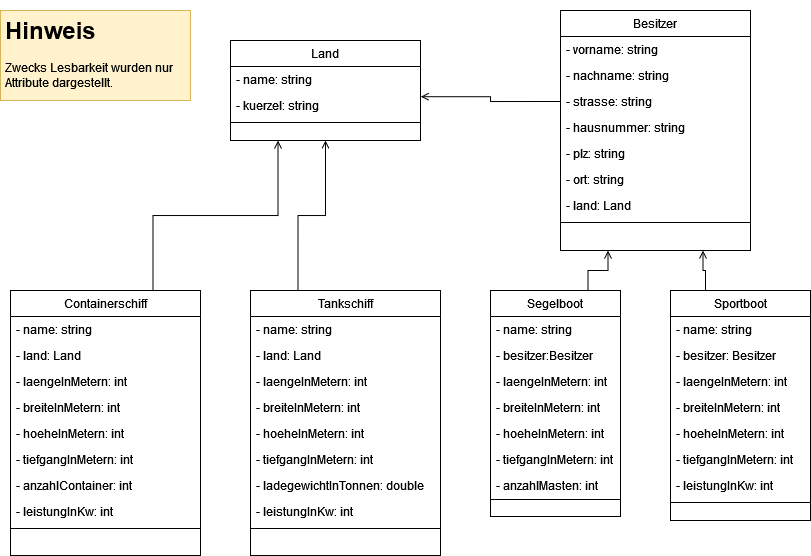

# 11.4_vererbung_SchiffeUndBoote
Die Struktur der Klassen[^1] ist im nachfolgenden UML-Klassendiagramm zusammengefasst[^2]: 

## Hinweise zum Code
- Das vorliegende Projekt enthält einige Python-Klassen, die `@properties` statt `get_`-Methoden einsetzen. Dadurch ist ein Zugriff z.B. durch `land.name`statt `land.get_name` möglich. Damit das geht, werden die Attribute mit einem Unterstrich gekennzeichnet[^3]. Mehr zum `@property`-Dekorator finden Sie [hier](https://realpython.com/python-property/#using-property-as-a-decorator).

- Im Ordner `tests/` sind Testfälle für jede Klasse (Testabdeckung 100%). Informationen zur Testdurchführung mit `pytest` und Abdeckungsanalyse mit `coverage` finden Sie [hier](https://gso-schule-koeln.gitbook.io/fu1).

## Arbeitsauftrag
1)  Refactoring: Wenden Sie das [DRY-Prinzip](https://www.generic.de/blog/dry-vs-kiss-clean-code-prinzipien) an, indem Sie Vererbung einsetzen um Wiederholungen zu minimieren!

    - Suchen Sie nach gemeinsamen Attributen in den Klassen um daraus geeignete Eltern-Klassen abzuleiten!

    - Ihr Refactoring ist erfolgreich, wenn alle Testfälle weiterhin erfolgreich sind.

2)  Erweitern Sie den Code, damit die folgenden Anforderungen erfüllt werden:

    a)  Über `ist_panamax` soll abgefragt werden können, ob man mit diesem Wasserfahrzeug durch den Panamakanal (alte Schleusen) passt.

    b)  `ist_scheinfrei`: Gibt Auskunft darüber, ob man einen Sportbootführerschein Binnen benötigt, um hiermit zu fahren. Allgemein gilt: Länge bis 15m, Segelfläche nicht größer als 6m², LeistungInKw nicht höher als 11.

    c)  `lloyd_registrierung`: Setzt sich bei allen Wasserfahrzeugen aus dem Namen in UpperCase zusammen. Sofern vorhanden soll der Nachname und Wohnort des Besitzers ebenfalls ausgegeben werden. Beispiele (bezogen auf die obigen Objekte):

        - "EVERGIVEN"

        - "UNSINKBARII--Holmes--London"

    d)  Der Name eines Bootes kann nur geändert werden, wenn **gleichzeitig** der Besitzer wechselt.
----
[^1]: Der Code wurde ursprünglich in C# verfasst und mit Hilfe von ChatGPT in Python übersetzt. Also halten Sie Ausschau nach Fehlern oder Unstimmigkeiten!

[^2]: Jedes UML-Diagramm dient in erster Linie der Kommunikation. Ich möchte hier nicht auf jedes Detail (Konstruktoren, getter/setter bzw. Eigenschaften) eingehen. Daher habe ich nur einen Teil dargestellt, der für einen ersten Überblick genügt.

[^3]: Ohne den Unterstrich hieße das Attribut exakt wie die Eigenschaft und der Interpreter wüsste nicht, worauf zugegriffen wird. Der Unterstrich ist eine Möglichkeit der Unterscheidung zwischen Attribut und Eigenschaft . In C# gib es ein ähnliches Vorgehen, bei dem Attribute immer LowerCase sind (z.B. `istEchtSo`), während die zugehörigen Eigenschaften exakt wie das Attribut heißen, aber UpperCase sind (z.B. `IstEchtSo`).
